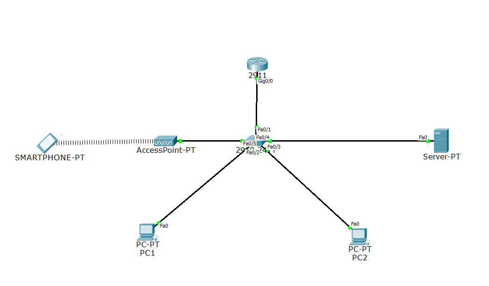

# Firewall ACL Configuration on Router (Packet Tracer)

## Overview
This project demonstrates how to configure **Access Control Lists (ACLs)** on a router in **Cisco Packet Tracer** to create a **firewall**. The firewall restricts access to a server (e.g., Web Server) based on IP addresses and services. Only **PC1** is allowed access to the server, while all other devices are denied.

### Objective:
- Configure a strict **Access Control List (ACL)** to allow **only PC1** to access a web server.
- Deny access from unauthorized devices (including the smartphone).
- Secure **router and switch passwords** and **configure port security** for additional protection.
- Simulate network security measures using **Packet Tracer**.

---

## **Network Topology**

- **Router** (with ACLs configured as firewall)
- **Switch** (for internal connectivity)
- **Server** (running HTTP service)
- **PC1** (allowed access to the web server)
- **PC2** (denied access to the web server)
- **Smartphone** (denied access to the web server)
- **Access Point** (providing wireless connectivity to the network)



### IP Configuration:
| Device         | IP Address      | Subnet Mask      | Default Gateway  |
|----------------|-----------------|------------------|------------------|
| Router (G0/0)  | 192.168.1.1     | 255.255.255.0    | -                |
| Server         | 192.168.1.10    | 255.255.255.0    | 192.168.1.1     |
| PC1            | 192.168.1.20    | 255.255.255.0    | 192.168.1.1     |
| PC2            | 192.168.1.30    | 255.255.255.0    | 192.168.1.1     |
| Smartphone     | 192.168.1.101    | 255.255.255.0    | 192.168.1.1     |
| Access Point   | 192.168.1.50    | 255.255.255.0    | 192.168.1.1     |

---

## **Configuration Steps**

### Step 1: **Network Setup**
1. Open **Cisco Packet Tracer** and create the network topology with a router, switch, server, two PCs, a smartphone, and an access point.
2. Assign IP addresses to each device, as shown in the table above.

### Step 2: **Configure ACL on the Router**
1. Open the **Router CLI** and enter the following commands to create and apply ACLs:
   ```bash
   enable
   configure terminal
   access-list 110 permit tcp host 192.168.1.20 host 192.168.1.10 eq 80
   access-list 110 deny ip any host 192.168.1.10
   access-list 110 permit udp any any eq 53
   access-list 110 permit icmp any any echo-reply
   access-list 110 deny ip any any
   interface gigabitEthernet 0/0
   ip access-group 110 in
   exit
   
### Step 3: **Test the ACL Configuration**
1. PC1 (192.168.1.20) should be able to access http://192.168.1.10 (Web Server).
2. PC2 (192.168.1.30) should be blocked from accessing the Web Server.
3. The Smartphone (192.168.1.40) should also be blocked from accessing the server because of the deny rule in the ACL.
4. Test DNS and ping responses to ensure PC1 can access services.
---
### Passwords Set for Security
1. Router:
Enable Password: 12345
Console Password: 12345
VTY Password (Remote Access): 12345
2. Switch:
Enable Password: 12345
Console Password: 12345
VTY Password (Remote Access): 12345

### **Configuration commands**
  ```bash
  Enable Password (Encrypted)
  enable secret 12345

  Console Password
  line console 0
  password 12345
  login

  VTY Password (Telnet/SSH)
  line vty 0 4
  password 12345
  login
```
---
### Port Security Configuration
For additional network security, port security was configured on the switch to restrict unauthorized access:

- FastEthernet 0/2 and 0/3 are configured to only allow 1 MAC address per port (to prevent unauthorized devices from connecting).
- Unused ports (0/5 to 0/24) are disabled to prevent unauthorized devices from accessing the network.

``` bash
enable
configure terminal
interface fastEthernet 0/2
switchport port-security
switchport port-security maximum 1
switchport port-security violation restrict
switchport port-security mac-address sticky
exit
interface fastEthernet 0/3
switchport port-security
switchport port-security maximum 1
switchport port-security violation restrict
switchport port-security mac-address sticky
exit
interface range fastEthernet 0/6-24
shutdown
exit
```
---
### Features
- **Strict ACL Firewall**: Only PC1 is allowed to access the Web Server (HTTP), while PC2 and the Smartphone are blocked.
- **Allowed Services**: DNS (UDP 53) and ICMP ping replies are allowed to ensure network functionality.
- **Simulated Firewall Setup**: Using Cisco Packet Tracer to configure network security via ACL.
- **Port Security**: Restricting unauthorized devices by limiting the number of allowed devices per port and disabling unused ports.
- **Secure Passwords**: Configured console, VTY, and enable passwords for the router and switch to prevent unauthorized access.
---
### How to Use
- Clone the repository to your local machine.
``` bash
git clone https://github.com/yourusername/firewall-acl-packet-tracer.git
```
- Open the .pkt file using Cisco Packet Tracer.
- Follow the configuration steps to set up the ACL on the router.
- Test the network by attempting to access the web server from PC1, PC2, and the Smartphone.
---
### Conclusion
This project demonstrates how to use ACLs to enforce security on a network by controlling access to services on a server. The configuration ensures that only authorized devices (PC1) can access sensitive services, such as a web server, while unauthorized devices (including PC2 and the Smartphone) are blocked. Additionally, passwords and port security enhance the overall security of the network.


